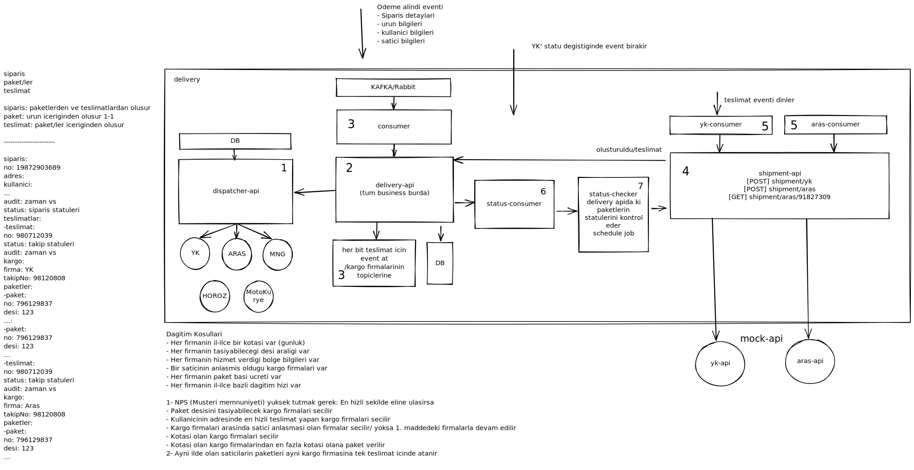

# Delivery Service

It is a hobby project where I am trying to create and experience the backend services of a simplified e-commerce site's delivery service. I aim to learn and experience this project by applying multiple software principles.

## Architecture

## Non-Functional Requirements

* Test-driven development
* Domain-driven design
* Containerization with Docker
* Deployment with Kubernetes
* Documentation with Swagger
* Code Quality and Code Security sonarcloud
* Testing with Code Coverage > 80%
