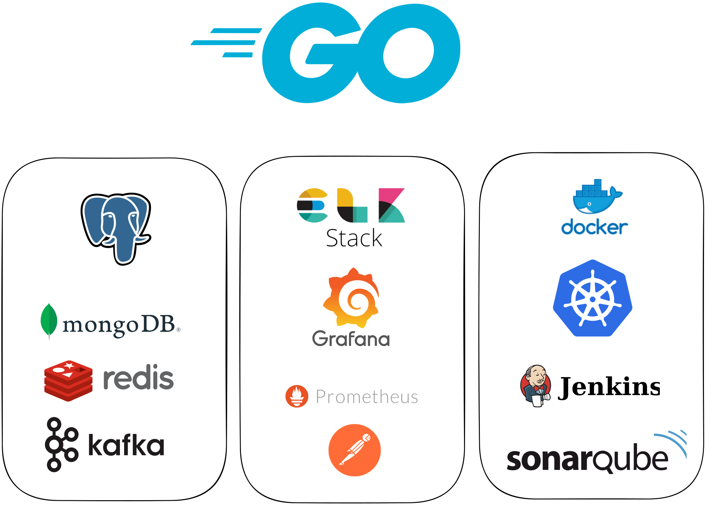
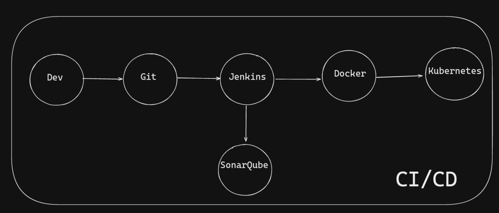
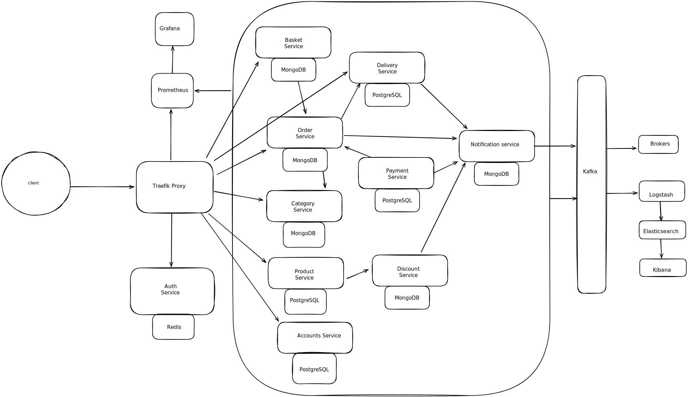

# micro-e

It is a hobby project where I try to create and experience the backend services of a simplified e-commerce site. I aim to learn and experience this project by applying multiple software principles.

## Tech Stack

## CI/CD Pipelines

## Microservices Architecture

## Non-Functional Requirements

* Test-driven development 
* Domain-driven design
* Source Code Management
* Containerization with Docker
* Continuous Integration/ Continuous Development with Jenkins,Docker,Kubernetes.
* Documentation with Swagger
* Monitoring with Prometheus
* Log collect and monitoring ELK Stack
* Code Quality and Code Security SonarQube
* Testing with Code Coverage > 80%

## Entities and Behaviors

